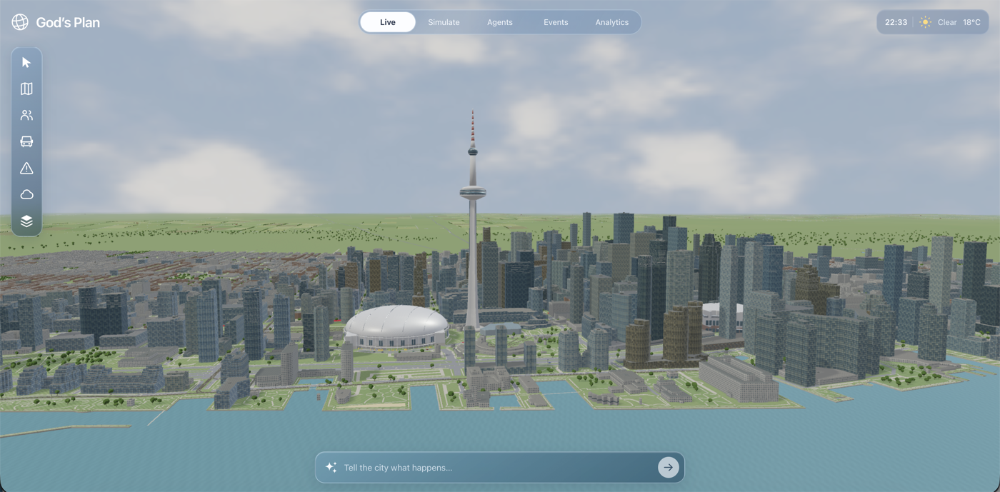
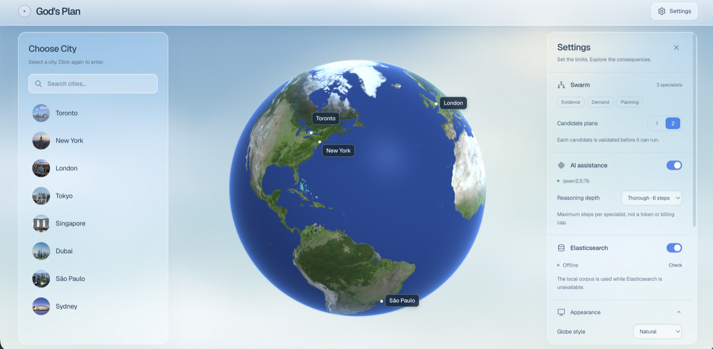
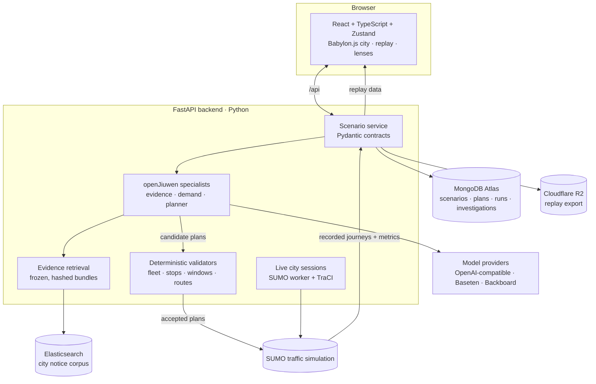

# God’s Plan: A Living Multi-Agent City Simulator

**Live demo → [agentsamong.us](https://www.agentsamong.us)**

## 💡 Inspiration

City simulators are great at modeling systems like traffic, population, and infrastructure, but the people inside them are usually just numbers following predefined behavior.

At the same time, modern AI agents can reason, communicate, use tools, and make decisions - but usually inside isolated chats or workflows.

We asked ourselves:

> **What if the people inside a city simulator could actually think?**

We wanted to build a city where residents could perceive what was happening around them, talk to each other, form relationships, make decisions based on their own knowledge, and physically act on those decisions.

That started with serious scenarios like transit failures, evacuations, and emergency response.

Then we realized the same system could answer much less responsible questions too.

So we added natural-language world control, tornadoes, earthquakes, riots, orbital strikes, and whatever else we could throw at the city.

God’s Plan became a mix of a **multi-agent simulation platform and a god game**.

---

## 🌎 What it does

**God’s Plan** is a 3D city simulation populated by thousands of autonomous AI residents.

Each resident has its own:

> **observations → goals → relationships → allegiances → internal state**

Agents can move through the world, communicate, drive vehicles, use tools, cooperate, fight, flee, and react to events around them.

### 🤖 Multi-Agent Swarms

Residents can belong to larger **swarms** representing groups such as civilians, emergency responders, police, transit operators, or custom factions.

Different swarms can be powered by different models - including **GPT, Claude, Gemini, and Grok** - while existing inside the same environment.

Instead of comparing models by asking each one the same prompt, we let their decisions **interact inside a shared world**.

### 💬 Natural-Language Simulation

Users can change the world simply by describing what they want to happen.

> “Evacuate downtown.”

> “A magnitude 7 earthquake hits Toronto.”

God’s Plan translates those instructions into simulation events or swarm objectives, then lets the agents decide how to respond.

### 👤 Inspect Any Resident

Every resident can be inspected individually.

Users can see what an agent knows, what it is thinking about, who it trusts, which groups it belongs to, and what it plans to do next.

From far away, you see a crowd moving through the city.

Click into one person and you can understand **why that crowd formed in the first place**.

---

## 🛠️ How We Built It

God’s Plan is built around a simple agent loop:

> **Perceive → Think → Act → Observe → React**

The complexity comes from running that loop across a large shared world.

### 🧠 The Agent System

Agents are only given information available to them: nearby residents, visible events, messages, memories, relationships, and swarm objectives.

The model reasons over that context and chooses from a set of structured tools:

> **move → inspect → communicate → follow → drive → interact → attack → defend**

This separation is important.

An agent can decide:

> “I should take that car and leave.”

But the model cannot simply declare that it succeeded.

The car has to exist, the agent has to reach it, and the road ahead still has to be accessible.

**The model provides the intention. The simulation determines the result.**

### 🕸️ Social Simulation

We maintain a **dynamic social graph** across the population containing relationships, group membership, allegiance, trust, sentiment, and shared history.

Those relationships feed back into future decisions, meaning two agents in the same situation can behave differently depending on who they know and what they have experienced.

Swarms provide higher-level objectives, while individual agents still make their own local decisions.

### 🏙️ The City

Our backend is built with **Python, FastAPI, and Pydantic**, which structure agent state, events, actions, scenarios, and simulation data.

We use **SUMO + TraCI** for transportation simulation, while the frontend uses **React, TypeScript, Zustand, and Babylon.js** to render the city in 3D.

The environment combines real street geography with Toronto building data, allowing agent decisions and city events to affect an actual shared world rather than an abstract grid.

---

## 🚧 Challenges We Overcame

### 1. Giving Agents Freedom Without Giving Them Magic

Language models are perfectly happy to say:

> “I get in the car and drive away.”

A simulation has to care whether the car exists, whether somebody else is using it, whether the agent can reach it, and whether the destination is still accessible.

We built a structured tool layer that lets agents reason freely while ensuring their actions still obey the physical state of the simulation.

### 2. Scaling Beyond a Handful of Agents

Thousands of residents cannot continuously call an expensive language model just to decide whether to keep walking.

We had to separate:

> **when an agent needs to think → what can remain deterministic → what state persists → what events trigger new reasoning**

This let us keep a large population active without treating every simulation step as an LLM request.

### 3. Making Agents Actually Feel Different

If every resident receives the same information and goals, you end up with thousands of copies of the same person.

We gave agents different information, relationships, priorities, histories, and positions in the world so their decisions could diverge naturally.

The result is less predictable, but far more interesting.

---

## 🏆 Accomplishments That We're Proud Of

### City-Scale and Individual-Scale Simulation

God’s Plan works at two very different levels.

You can zoom out and watch thousands of residents form crowds, move through the city, coordinate, and react to changing conditions.

Then you can click one resident and understand the individual decision behind that larger pattern.

### Natural Language as a World Interface

We are especially proud that natural language controls the **simulation itself**, rather than just another chatbot.

Instead of asking:

> “What would happen if downtown lost power?”

you can tell the city:

> “Downtown just lost power.”

and watch the agents deal with it.

### A Shared World for Different AI Models

Rather than running agents in isolated conversations, we put them into the same environment, where one group's decisions can directly affect what another group sees and does next.

That makes the interaction between agents as important as the intelligence of any individual model.

---

## 🎓 What We Learned

The biggest thing we learned is that multi-agent systems become much more interesting when agents **share consequences**.

One agent can make a perfectly reasonable decision that changes the environment for everyone else. Hundreds of individually sensible choices can create congestion, panic, or unexpected coordination without any agent explicitly planning that outcome.

Those emergent behaviors became some of the most interesting parts of God’s Plan.

We also learned that the boundary between AI reasoning and simulation matters enormously. Agents are much more believable when they can make their own decisions but still have to obey the world they live in.

And finally, giving users both an unrestricted text box and an orbital-strike button does not encourage responsible urban planning for very long.

---

## 🗺️ What's Next for God’s Plan

We want to deepen the parts of the simulation that make the agents feel persistent.

- **Long-Term Memory:** Let experiences continue influencing agents over longer simulations.
- **Richer Social Dynamics:** Allow relationships, beliefs, trust, and reputation to evolve.
- **Emergent Groups:** Let agents form alliances, choose leaders, disagree, and split apart organically.
- **More Expressive World Control:** Expand the natural-language interface so increasingly complex scenarios can be created without manually configuring the simulation.

Ultimately, we want God’s Plan to be a world where AI agents are not merely reasoning *about* a simulation from the outside.

They have to **live inside it**.

---

## 🧩 How we used the sponsor platforms

### Huawei · openJiuwen — specialists with bounded tools

Our investigation pipeline uses openJiuwen ReAct agents for evidence analysis, demand analysis, and planning. Each specialist has an `AgentCard` and narrowly scoped, read-only tools registered through `ability_manager`. Analyst findings become planner context; proposed plans then pass through deterministic validation with a bounded repair attempt.

What we liked was the clear boundary between a model's reasoning and its available tools. Specialists can inspect the scenario and propose changes, but cannot invent measured outcomes. Separately, the live city's deterministic proximity-gossip system uses message fields compatible with openJiuwen's `MessageEnvelope`; it is not an LLM call for every resident or every simulation step.

### Elasticsearch — evidence with provenance

We implemented per-city indexing and `multi_match` queries over notice titles and bodies, with title weighting and fuzzy matching. Retrieved claims become **frozen, content-hashed evidence bundles** with source identifiers, effective windows, and unresolved mappings. If Elasticsearch is unavailable, retrieval uses an explicitly labeled local fallback.

This makes retrieval inspectable rather than hiding it inside a prompt. Our current corpus consists of labeled scenario fixtures with preassigned `confirmed`, `pending`, and `superseded` statuses, not a live municipal feed. Real notice ingestion is the next extension.

### Rox · Best AI Agent — why the challenge fits

Rox is a challenge we are targeting, not an SDK in our stack. Its focus on acting under incomplete and conflicting information matches our design: the analyst distinguishes an earlier lane-closure notice from its replacement, while the planner must satisfy fleet limits, valid stops, service windows, route reachability, and vehicle continuity.

A rejected plan receives concrete validation feedback instead of being accepted because its explanation sounds convincing. The live simulation also models local awareness and information spreading between neighbors. These are useful foundations for the challenge; the evidence-conflict demonstration currently uses fixtures rather than messy, independently ingested real-world documents.

### OpenAI models via OpenRouter — turning reasoning into testable plans

Our project handoff records a Toronto investigation using `openai/gpt-4o-mini` through **OpenRouter**, which produced two validated candidate plans and a subsequent SUMO run. The model helped summarize evidence and formulate shuttle assignments; deterministic code and SUMO remained responsible for feasibility and outcomes.

The OpenAI-compatible interface let us reuse the same agent code across hosted and local endpoints. In our documented local-model experiment, the strict-JSON planning step timed out; the hosted run completed. This is a specific development observation, not a general model benchmark or a claim of direct OpenAI API usage.

### Backboard — a tested provider bridge

We built an adapter between openJiuwen's chat-completions interface and Backboard's thread API. Tool results continue the thread that issued them through `/threads/tool-outputs`, using a tool-call-to-thread mapping; a local `/llm/v1` shim exposes the compatible interface to the framework.

The useful architectural feature is continuity across tool calls without changing the agent layer. Memory is explicitly disabled rather than used as hidden simulation state. The adapter has mocked unit tests; the documented live attempt was blocked by account credits, so we do not claim a completed live Backboard investigation.

### MongoDB Atlas — durable experiment records

We implemented Atlas-backed storage for scenarios and demand, plans and validations, run status, evidence, and investigations. Related scenario/demand and plan/validation data are stored together so they cannot be partially persisted. Large city packs and replay artifacts remain on disk.

The document model fits our nested Pydantic records well. We added document-size checks, duplicate-write protection, and an explicit offline JSON mode rather than silently switching storage when Atlas fails. Storage tests use an in-memory MongoDB mock, not the live database.

### Cognition · Devin — engineering and delivery assistance

We used Devin to inspect the codebase, run verification, configure and deploy the Vercel frontend, add SPA routing, prepare the architecture documentation, and update our Devpost submission. Devin also attached the custom domain to Vercel and checked its DNS configuration after the records were updated.

The valuable part was moving between code, CLI tooling, and browser workflows while checking the result. A concrete example is the deployment path: the frontend was deployed, deep links were checked, and browser inspection exposed the missing backend connection rather than treating an HTTP 200 as proof that the whole simulator worked.

---

# Local storage setup

Application records now use **MongoDB Atlas** by default. Before starting the API, set
`MONGODB_URI` (the Atlas `mongodb+srv://` connection string) and `MONGODB_DATABASE` in
`backend/.env` or the process environment. The example database is `cityshift_events_development`;
use a separate database per environment. Keep the URI out of source control and frontend variables.
Allow the backend's IP in Atlas Network Access and give its database user `readWrite` access only
to the chosen database. TLS certificate and hostname verification stay enabled; an approved custom
CA bundle can be supplied with `MONGODB_TLS_CA_FILE` if required by your network.

Scenarios and their demand are inserted together as one immutable document. Plans and validations
are likewise stored together; run status, evidence, and investigations also live in Atlas. City
packs and large SUMO/replay artifacts remain on disk (R2 export is still optional). Existing JSON
records are not automatically imported, overwritten, or deleted. Run execution remains local to a
single backend process; Atlas is not a distributed simulation job queue. `/api/health` reports
storage readiness without exposing the connection string. Atlas failures do not silently switch stores.

Select Atlas with `CITYSHIFT_STORAGE=mongodb`; for an explicitly offline demo, set
`CITYSHIFT_STORAGE=json`. The legacy `CITYSHIFT_STORE` setting is accepted only when
`CITYSHIFT_STORAGE` is absent. Unit tests use isolated temporary JSON stores or an in-memory
MongoDB mock and do not require Atlas credentials. Documents larger
than MongoDB's 16 MiB limit are rejected before writing; reduce the scenario cohort if necessary.
