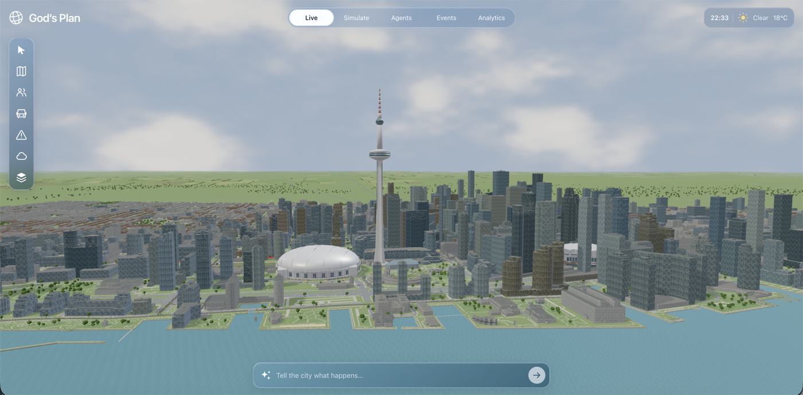
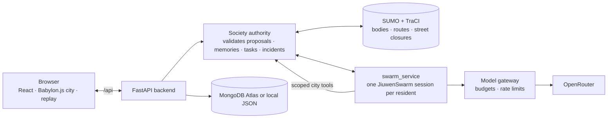

# God’s Plan

A 3D Toronto where every resident is its own AI agent, living inside a real traffic simulation.

**Live demo → [agentsamong.us](https://www.agentsamong.us)** (a frozen snapshot; AI residents need a local backend and an OpenRouter key)



## The idea

City simulators treat people as numbers following fixed rules; AI agents usually live in isolated chats. God’s Plan puts agents *inside* a city: each resident sees only its own situation, decides for itself, and has to live with what the city makes of that decision.

> **The AI decides what to do. The city decides what actually happens.**

## How a resident works

Each resident has a persona, roles (customer, shop or service worker, courier, driver), a home and workplace, known contacts, the vehicles it owns, everyday needs, commitments, and a memory of what happened to it.

Every 30 simulated seconds, or sooner when something happens to it, a resident that is free to act takes a turn:

1. **Observe.** Its own model session receives a private observation: where it is, its tasks and messages, its recent memories, trip estimates, and any incidents it knows about. Other residents’ private state is never visible.
2. **Decide.** Using six scoped city tools (look around, recall memories, view tasks, estimate a trip, propose a message, propose an action), the model proposes one action for itself, plus optionally one message to a contact.
3. **Check.** The city validates the proposal: right resident and decision round, current world state, reachable destination, an open task, and so on. Invalid proposals are rejected with a reason the resident sees next turn.
4. **Act.** Accepted actions become physical outcomes in [SUMO](https://eclipse.dev/sumo/). Travel is a real walker, bicycle or vehicle on Toronto’s streets. Arrival, pickup and delivery happen only when the simulation says so.

The actions are `travel`, `request_service`, `accept`, `decline`, `prepare`, `pickup`, `deliver`, `visit`, `serve`, `report_delay`, `revise_commitment`, `message`, `wait`, `rest`, and, while travelling, `continue` and `redirect`. Residents coordinate only by messaging each other and by taking on each other’s requests; there is no central planner.

Different residents can run on different models. Reviewed models are Claude Haiku 4.5, GPT-4.1 mini, Gemini 3.1 Flash Lite and Grok 4.3, all through OpenRouter. A run holds up to 100 residents; the default is 100 residents for 10 simulated minutes with a $10 spending cap. The run pauses rather than overspend.

## How residents react to events

Drop an incident on the map (fire, flood, gas leak, tornado, crash, storm or rain), set the temperature, or send an announcement. Incidents do three things:

- **They close streets.** Streets inside the footprint close for the incident’s duration:

  | Incident | Closed to |
  | --- | --- |
  | Fire, flood, gas leak, tornado | Everyone |
  | Crash, storm | Vehicles; sidewalks stay open |
  | Rain | Nothing |

  Vehicles already on the road reroute. Walkers take a detour. New trips route around the closure, and a destination inside it is unreachable. People caught inside may still leave. With no detour, the resident is told its way is blocked and is asked again while it stays blocked: a vehicle pulls over before the closure and waits for it to lift, and a walker keeps going unless its resident chooses otherwise, because SUMO cannot hold a walker back.
- **People notice them.** Residents within the warning radius see the incident, including residents who are travelling. The warning radius is wider than the footprint (three times wider for a fire). Word of mouth passes the news between people at the same place, for up to three retellings. Telling friends elsewhere is the model’s own choice, by message.
- **Each resident decides.** Nothing scripts a response. A resident who hears about a fire might cancel an errand, warn a contact, or keep going. A traveller who sees an incident, or whose route it blocks, is woken mid-trip and can `continue`, `redirect` to another destination, or send a message. Turning away from a trip that serves a commitment fails that commitment.

Injuries and building damage are not simulated; the damage you see is visual only.

## Everything is on the record

Every decision records the model that actually answered, its cost, a short summary, the plan and beliefs it gave, and whether the city accepted the action and why. A failed model call is recorded as an explicit fallback, never filled in with an invented decision. Runs publish atomic snapshots, pause at sealed checkpoints, and resume with the same outcomes. Click any resident to replay what it knew, proposed and experienced at any moment.

A paid trial with 100 Claude Haiku 4.5 residents and a district-wide rain warning, run before street closures and mid-trip decisions were added, produced, by a sealed pause at +38 simulated seconds, 142 accepted native decisions, 6 labelled fallbacks and 97 delivered contact messages ([details](docs/NATIVE_CITY.md)).

## Street mode

The city can also run a rule-based street simulation of about 600 travellers. They are not AI agents. They spread incident news by proximity gossip and reroute or evacuate by fixed rules, which makes that mode useful at crowd scale.

## Architecture


```mermaid
flowchart LR
    UI["Browser<br/>React · Babylon.js city · replay"] <-->|"/api"| API["FastAPI backend"]
    API --> SOC["Society authority<br/>validates proposals · memories · tasks · incidents"]
    SOC <--> SUMO[("SUMO + TraCI<br/>bodies · routes · street closures")]
    SOC <--> SWARM["swarm_service<br/>one JiuwenSwarm session per resident"]
    SWARM -->|"scoped city tools"| SOC
    SWARM --> GW["Model gateway<br/>budgets · rate limits"] --> OR["OpenRouter"]
    API --> DB[("MongoDB Atlas or local JSON")]
```

- `backend/cityshift/domain/society.py`: resident state, decision rounds, proposal validation, incident awareness.
- `backend/cityshift/transport/population.py`: residents’ bodies in SUMO, street closures, detours, mid-trip redirects, checkpoints.
- `backend/cityshift/transport/hazards.py`: the shared hazard table and footprint rule.
- `swarm_service/`: the isolated JiuwenSwarm runtime that hosts the resident sessions.
- `frontend/`: the globe, the city, and the resident inspector.

## Run it locally

```bash
uv venv --python 3.12 .venv
uv pip install --python .venv/bin/python -e 'backend[dev]'
.venv/bin/python -m cityshift.citypack.make_pack toronto          # build the Toronto city pack
(cd swarm_service && uv sync --frozen)                            # resident runtime, separate environment
(cd frontend && npm ci --legacy-peer-deps && npm run build)

# backend: live residents need an OpenRouter key in the ignored backend/.env (OPENROUTER_API_KEY=...)
CITYSHIFT_POPULATION_LIVE=1 CITYSHIFT_STORAGE=json .venv/bin/uvicorn cityshift.api.app:app --host 127.0.0.1 --port 8000
# frontend
(cd frontend && npm run preview -- --host 127.0.0.1 --port 5173)
```

Open <http://127.0.0.1:5173>, pick Toronto, then open **Population** to create residents. Creating residents makes no model calls; only **Start** or **Resume** does. Storage defaults to MongoDB Atlas (`MONGODB_URI`, `MONGODB_DATABASE`); `CITYSHIFT_STORAGE=json` keeps everything on disk. See `docs/NATIVE_CITY.md` for the spending controls.

## Tests

```bash
cd backend && CITYSHIFT_STORAGE=json MONGODB_URI= MONGODB_DATABASE= ../.venv/bin/pytest -q
cd backend && ../.venv/bin/ruff check cityshift tests && ../.venv/bin/mypy cityshift
cd swarm_service && .venv/bin/python -m pytest -q && .venv/bin/ruff check src tests
cd frontend && npm test && npm run lint && npm run build
```

Rules-driven fixtures test the city’s side of every rule without model calls; they are not evidence of live model behaviour.

## Built with

SUMO/TraCI · FastAPI · Pydantic · React · Babylon.js · Zustand · Huawei openJiuwen and JiuwenSwarm · OpenRouter · MongoDB Atlas · Elasticsearch (evidence retrieval for the transit analysts) · Vercel
