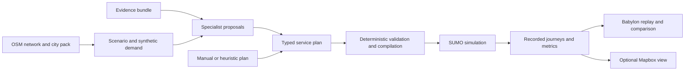

# CITY//SHIFT — local demo and project review

Verified 2026-09-19. Reviewed base: `af5b022`. This document records the working local setup, architecture findings, and proposed improvements. It does not claim a completed redesign or deployment.

## Open the demo

- Frontend: <http://127.0.0.1:5174/>. The existing <http://127.0.0.1:5174/world> link opens the same **Babylon.js 3D city and full interface**, including Compare.
- Mapbox Standard 3D alternative: <http://127.0.0.1:5174/mapbox>. The Developer panel links between renderers.
- Backend health: <http://127.0.0.1:8000/api/health>; API reference: <http://127.0.0.1:8000/docs>.
- Mapbox's public token is configured in ignored `frontend/.env.local`. Do not copy the value into source, screenshots of configuration, or this document.
- Both Toronto and Waterloo city packs were downloaded and compiled locally. They, simulation runs, and exports live under ignored `var/`.
- `/world/lab` remains the bare Babylon viewer for renderer experiments. The main application defaults to Babylon; Mapbox is selected explicitly at `/mapbox`.

The reported `world.json for toronto: HTTP 404` came from the missing generated city pack. Toronto's `world.json` now exists and is served successfully. Babylon builds its city from these local OSM/SUMO artifacts. The alternative Mapbox renderer obtains its visual buildings and basemap from Mapbox. Both use the same recorded simulation and application shell.

### Restart commands

From the repository root, run the backend in one terminal:

```sh
cd backend
../.venv/bin/uvicorn cityshift.api.app:app --host 127.0.0.1 --port 8000
```

Run the frontend in another terminal:

```sh
cd frontend
npm run dev -- --host 127.0.0.1 --port 5174 --strictPort
```

Port 5174 was selected because 5173 was already occupied by another project. The Vite `/api` proxy targets port 8000, so browser requests remain same-origin.

For a fresh install, the verified commands were `uv venv --python 3.12 .venv`, `uv pip install --python .venv/bin/python -e './backend[dev]'`, and, inside `frontend`, `npm ci --legacy-peer-deps --no-audit --no-fund`. Plain `npm ci` failed because the committed lockfile and npm's peer-dependency resolution disagreed. The legacy-peer install succeeded without changing the lockfile. Resolve that install policy explicitly before a clean-machine handoff.

Generate missing city assets from the repository root:

```sh
.venv/bin/python -u -m cityshift.citypack.make_pack toronto
.venv/bin/python -u -m cityshift.citypack.make_pack waterloo
```

Do not rebuild existing packs during a demo: the compiler fetches OSM data and builds a SUMO network. Toronto has 188 candidate stops, five demand zones, and network fingerprint `86e01e8321fff521`; Waterloo has 149 stops, five zones, and fingerprint `61e25924d004d6e9`.

## What the product actually does

The useful product promise is: **give a city a disruption and a finite resource budget, propose responses, and measure what those responses do to the same travelers.**



The diagram describes the available components. Evidence provenance is not yet fully connected into run manifests, and agent investigations do not currently execute the SUMO feedback loop themselves.

| Responsibility | Main implementation | Mechanism and boundary |
| --- | --- | --- |
| Domain contract | `backend/cityshift/contracts.py` | Pydantic models for packs, scenarios, finite fleets, plans, evidence, investigations, and measured runs. |
| Real geography | `backend/cityshift/citypack/` | Fetches OSM tiles, builds the SUMO network, and generates city artifacts. The simulation demand and example closure notices are synthetic. |
| Scenario and cohort | `domain/scenarios.py`, `domain/demand.py` | A repeatable event-egress problem with a fixed cohort, declared walking limits, resource constraints, and timed restrictions. |
| Feasibility | `domain/validators.py`, `domain/compiler.py` | Checks fleet, stops, windows, continuity, and route reachability; builds physical vehicle duties and SUMO inputs. Some checks are soft warnings. |
| Simulation | `domain/runs.py`, `transport/runner.py` | Runs SUMO/TraCI and records position samples, boardings, alightings, waiting, arrival, vehicle occupancy, and diagnostics. Runs have stable IDs for the same inputs and seed. |
| Evidence | `backend/cityshift/evidence.py` | Six fixture documents per city with preassigned statuses; Elasticsearch retrieval when available, token-overlap fallback otherwise. This is not live city-notice ingestion or demonstrated LLM conflict resolution. |
| Agents | `agents/orchestrator.py`, `agents/tools.py` | Creates openJiuwen ReAct specialists with bounded tools; forwards analyst output into planner context; converts sketches to typed plans; validates and attempts a repair. |
| Edits | `domain/edits.py`, `frontend/src/shell/ProposalCard.tsx` | Structured preview, visible ghost, user confirmation, then a child scenario. The common command path uses deterministic parsing; ambiguous input may use the LLM. |
| Replay | `frontend/src/replay.ts`, `world/layers.ts`, `world/playback.ts` | Interpolates recorded tracks on a shared clock; gaps break trails. People riding buses are represented consistently with their journey events. |
| Renderer | `babylon/WorldBabylon.tsx`, `babylon/WorldCanvas.tsx`, `world/registry.ts` | Babylon is the default; thin-instance traffic, city geometry, and a camera adapter connect to the shared simulation clock and Compare. `world/WorldMap.tsx` provides the explicit Mapbox/deck.gl alternative. |
| Application state | `frontend/src/store.ts` | Loads packs, scenarios, plans, runs, and replays; owns selection and scenario branching. Investigation state is not recovered after refresh. |
| Export | `api/share_router.py` | Packages local run artifacts. R2 publishing requires separate configuration. |

Paths beginning `domain/`, `agents/`, `transport/`, or `api/` above are relative to `backend/cityshift/`; renderer paths are relative to `frontend/src/`.

### Why the simulation is valuable

The replay is tied to actual simulated outcomes. A planner cannot claim success simply by emitting convincing text: a plan must compile, survive the resource checks, and produce measurable journeys. The existing comparison can also match travelers across runs, which is more informative than comparing only each run's successful arrivals.

This remains an experiment with declared synthetic demand. It is not calibrated against observed Toronto traffic, a live transit dispatch system, or evidence that a real city intervention will achieve the same result.

## Measured local scenario

Scenario: `concert-egress-toronto-n240-h2700-s7`. Demand seed 7; run seed 1; 240 travelers; 45-minute horizon; two extra 60-seat buses available for a 35-minute service window. All three plans below were existing baseline/heuristic plans, not newly generated agent plans.

| Plan | Completed / 240 | Unroutable | Still travelling or waiting | Bus boardings | Waiting person-minutes | Completed-only median |
| --- | ---: | ---: | ---: | ---: | ---: | ---: |
| Baseline: no extra service | 194 | 42 | 4 | 0 | 0 | 1,014.5 s |
| Direct shuttles: two busiest zones | 198 | 13 | 29 | 90 | 1,295.9 | 1,069 s |
| Split routes: two drop stops per bus | 148 | 4 | 88 | 116 | 3,725.9 | 927 s |

Run IDs:

- Baseline: `run-780e36a137f3`
- Direct: `run-40dcc9f7736f`
- Split: `run-f095d1dad589`

The direct plan gets four more travelers to their destinations within the horizon and gives a route to 29 travelers who lacked one in the baseline. It also introduces shuttle waiting and does not improve the completed-only median. The split plan covers more travelers but leaves many in transit when the horizon ends. Its lower median is not proof of a better overall outcome: it is computed on a different, smaller group of successful arrivals.

That tradeoff is a useful demonstration of why proposals need experiments. Do not describe these results as a universal speedup or choose only the most flattering metric. Inspect matched-traveler results in **Lens → Transport** and report arrivals, unresolved journeys, and unroutable travelers alongside duration.

All three runs used SUMO 1.27.1. Their metrics account for all 240 travelers, track JSON contains finite coordinates, and exported metrics match stored results. Recorded warnings include 9/10/11 teleports respectively; replay trails break across jumps. The recorded closure audit found no closed-edge crossings in these three runs.

A local export was verified for the direct plan: <http://127.0.0.1:8000/api/exports/run-40dcc9f7736f.zip>. It is a local artifact download, not a public deployment.

## Current integration status

| Capability | Verified here |
| --- | --- |
| Babylon.js 3D | Default full interface at `/` and `/world`, using the compiled local city pack and recorded simulation; Compare uses Babylon on both sides. |
| Mapbox Standard 3D | Alternative at `/mapbox`, configured with a local token and visually verified with Toronto landmarks and simulation overlays. The backend health token flag reads backend configuration, not `frontend/.env.local`. |
| SUMO | Installed, three full runs completed, replay and export verified. |
| openJiuwen | Framework and role/tool code present. No live investigation verified in this environment. The configured local Ollama endpoint is unavailable. |
| OpenAI / Gemini | No live product API integration verified in this checkout. Codex is being used for development; that is a separate fact from product API usage. |
| Elasticsearch | Local endpoint unavailable. Fixture/fallback evidence remains usable. |
| Sentry | Disabled without configuration. |
| Cloudflare R2 | Unconfigured; local export works. |

The old handoff records work in another environment. Its provider successes must not be used as evidence of this machine's present runtime.

## Hack the North priorities

Official references: [Devpost](https://hackthenorth2026.devpost.com/), [rules and schedule](https://hackthenorth2026.devpost.com/rules). Sponsor selections are already saved, as confirmed by the team. Final project edits are due **September 20 at 8:00 AM EDT**.

The openJiuwen challenge emphasizes collaboration, task decomposition, communication, and coordinated tools. Rox emphasizes turning messy real-world data into useful action. OpenAI requires meaningful product API usage and Codex development; Gemini requires meaningful Gemini API use. General judging includes originality, design, technical difficulty, and the WOW factor. These are selection signals, not a guarantee of eligibility or an award.

The following are proposed product improvements, not existing capabilities:

1. **Close the agent experiment loop.** Give a coordinator an explicit objective and resource budget. Evidence and demand specialists publish structured findings. A planner proposes duties; a reviewer challenges feasibility and weak assumptions; an experiment tool runs SUMO; an evaluator compares outcomes and requests a bounded revision. Show actual messages, tool calls, rejected proposals, and the reason for the final recommendation. The current fixed sequence of role calls does not yet demonstrate this coordination. Consider [JiuwenSwarm](https://github.com/openJiuwen-ai/jiuwenswarm) where it adds concrete task ownership and communication; the implementation matters more than a framework label.
2. **Introduce real, bounded messy evidence.** Use a small set of attributable notices or uploaded documents with timestamps and conflicting claims. Preserve the original text, extract typed claims, distinguish unknown from contradicted, and link every accepted restriction to its source. One strong conflict-resolution example would make the Rox story much more concrete than expanding the fixture count.
3. **Assign useful roles to model providers.** A possible division is Gemini for extracting claims from notices/maps and OpenAI for planning or reviewing experiments. Use direct, inspectable API calls, track provider/model usage, and show what each contribution changed. Avoid duplicating the same chatbot merely to list another sponsor.
4. **Make the experiment legible in the Babylon city.** Keep the miniature city as the central stage. Show the event, closure, two-bus limit, and objective immediately. Add a compact agent activity view, visible stop/route intent, clear waiting crowds, a synchronized baseline comparison, and a final outcome card with citations and unresolved travelers. Preserve the Babylon renderer and use Mapbox as an optional alternative.
5. **Rehearse a complete short story.** Begin with the disruption, show one disagreement or rejected plan, run or replay the measured alternatives, follow an affected traveler, then explain the recommendation and its limitations. Cached, labeled measured runs can support a reliable fallback if a live model call is slow.

A useful four-minute presentation would spend roughly 30 seconds on the problem, 60 seconds on collaborating specialists and evidence, 70 seconds on validation/experiments, 60 seconds on the Babylon comparison and one traveler, and 20 seconds on the measured conclusion. That timing is a proposed script, not a claim that the live agent loop already exists.

## Highest-value engineering follow-ups

These are code-review findings to address before expanding scope:

- **Agent polling:** `SwarmLens.tsx` polls only `running`; an initial `queued` response can leave the investigation view stale. Investigations also need scenario ownership and refresh recovery.
- **Evidence identity and provenance:** bundle identity is based on pack and source IDs while content/provenance can change; first-write behavior can preserve stale bundles. Investigation evidence is not propagated into the scenario evidence hash used by run manifests. Use content-addressed provenance and retain the causal link into exports.
- **Closure-audit wording:** in `domain/runs.py`, the all-clear `else` belongs only to `if caught`. If a run has `entered` violations but no `caught` vehicles, it can emit both a violation warning and an all-clear. The all-clear should require neither case. The measured runs above had neither, so their reported state is unaffected.
- **Planner tools:** `check_plan` exists but is not in the planner's tool list. Expose validation deliberately as part of the feedback loop rather than relying solely on post-generation repair.
- **Unavailable providers:** make agent availability and retry behavior clear in the UI. Do not present a live investigation as ready when its configured endpoint is down.
- **Incomplete interventions:** road/intersection controls are placeholders. Stop relocation semantics need to match the proposed destination. Hide or finish these controls before judging.
- **Cold load and recovery:** failed `world.json` loads cache a rejected promise until refresh. Generate the city pack before a demo and add a retry path. The default Babylon view uses local geometry; the optional Mapbox route needs its token and network access. The broken token-free MapLibre fallback has been removed.
- **Rendering and legibility:** dense buildings can hide the travelers that explain the result. Tune camera framing and overlay visibility before adding decorative animation. Babylon Compare renders two engines; test it on the presentation machine and consider a quality setting for shadows and ambient occlusion.
- **Installation and bundle size:** formalize npm's peer-dependency policy. The build passes but reports large renderer chunks. Establish a predictable clean install and warm the intended demo route.

## Changes and checks in this session

Local configuration enables the Mapbox alternative; the code makes Babylon the default at `/` and `/world`, isolates Mapbox at `/mapbox`, keeps Compare consistent with the selected renderer, and fixes manually authored bus plans to use the backend's accepted `authored_by: 'user'` value. The frontend type now uses the backend's allowed author values. Renderer diagnostics identify the active view and link to the alternative. The Mapbox token and generated city/run artifacts remain in ignored local files; source changes and this review are versioned in Git.

Verification performed:

- Backend: **28 tests passed** after both city packs were generated; Ruff passed; mypy passed across 35 source files.
- Frontend: **28 tests in six files passed**; TypeScript/production build and lint passed. The bundle-size warning remains.
- HTTP: frontend, backend health, and generated city data responded successfully.
- Browser: the Babylon city, recorded simulation layers, timeline seeking, camera controls, synchronized Compare, and divider dragging were inspected. Mapbox was also visually verified as an alternative.
- Manual-plan contract: `operator` was rejected with HTTP 422; `user` validated successfully.
- Three complete SUMO runs and a local replay export were inspected as described above.

The next substantial implementation should connect evidence, specialist coordination, validation, simulation, and outcome explanation into one visible loop. The map and simulator already provide a credible stage for that work.
